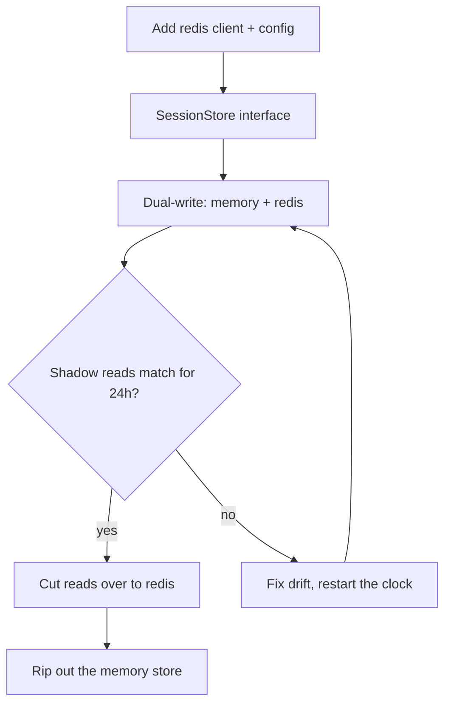

# Show, Don't Tell

One rule: when the content is a plan, a design, or a process, the diagram is the
deliverable. A diagram forces you to commit to order, branches, and failure paths that
prose lets you mumble through — and the reader can veto a box faster than they can veto
a paragraph. That's why the diagram leads and the prose chases.

## When a diagram is mandatory

- Presenting a plan for approval (whatever the runtime calls that step — the plan itself
  IS the diagram).
- Writing or reviewing a plan, spec, design doc, architecture proposal, or RFC.
- Answering "how should we build/fix/migrate X".
- Explaining any workflow, pipeline, or process with three or more steps.

Litmus test: if your draft contains an ordered sequence ("first... then..."), a branch
("if X, otherwise..."), or three-plus components interacting, it's diagram territory.
"The plan is small" is not an out — small plans make small diagrams.

## Pick the diagram type

| You are producing | Use | Why it fits |
|---|---|---|
| Plan for approval, pipeline, decision logic | `flowchart TD` | Order and branching ARE the content — every diamond is a veto point the reader can poke |
| API calls, service interactions, auth handshakes | `sequenceDiagram` | Who talks to whom, in what order, is the content — the bug usually lives in the arrows |
| Lifecycle: job, order, connection, feature flag | `stateDiagram-v2` | Legal transitions and dead ends are the content |
| Data model, schema, entity relationships | `erDiagram` | Entities and cardinality are the content |
| Phased rollout, migration timeline, parallel workstreams | `gantt` | Duration and overlap are the content |

Nothing matches → default to `flowchart TD`. Generalize from the third column: pick the
type whose native shape carries the actual information, so the diagram replaces prose
instead of decorating it.

## Layout: diagram first, chaser second

The mermaid block comes first. Under it, at most ~5 lines of prose: the status or
verdict up front, the one risky step, the blocker if any, and the exact ask ("approve
and I start on A"). If the chaser outweighs the diagram, cut the chaser — a diagram
bolted under standalone prose is decoration, and you did it wrong. If another rule
you're following says the status goes in the opening line, this layout satisfies it:
the chaser's first line IS the status line — diagram first, verdict immediately under.

## Syntax safety — a diagram that doesn't render is worse than prose

- Quote any label with special characters: `A["parse config (yaml)"]`, `D{"reads match?"}`.
  Parens, colons, and slashes in bare labels break the parser.
- Quote edge labels with punctuation too: `A -->|"429 / backoff"| B`.
- One statement per line. No semicolon-chained one-liners.
- Keep labels short and functional — detail lives in the chaser, not the node labels, so
  the diagram survives being pasted anywhere.
- Target the GitHub-renderable subset: `stateDiagram-v2` never v1, no `%%{init}%%` theme
  directives, no beta diagram types, no HTML in labels.
- Node ids stay plain alphanumeric (`A`, `step2`, `cutover`); the human words go in the
  quoted label.
- Non-flowchart types have their own traps — in `gantt`, declare `dateFormat YYYY-MM-DD`
  and keep colons out of task names (colon is the field separator); the quoting rules
  above are for flowcharts, not sequence/er/gantt bodies.

## Worked example — a plan presented for approval

That's the whole plan. Only risky step is C — dual-write doubles session-write latency
until cutover; if p99 degrades we fall back to memory with one env flag. Nothing
blocked. Approve and I start on A.

## Pre-send self-check

Run this before every send. Any "no" → fix it, don't send:

1. Plan, spec, design, "how do we build it", or 3+ step explanation? → mermaid block
   present and FIRST.
2. Diagram type matches the table, or defaulted to `flowchart TD` deliberately.
3. Renders on GitHub: syntax rules for the chosen type followed (flowchart label
   quoting; gantt `dateFormat` and colon-free task names), one statement per line,
   short labels.
4. Chaser is ~5 lines max, opens with the status or verdict, and is lighter than the
   diagram.

If you catch yourself rationalizing past check 1 — "it's basically a summary", "they
just want a quick answer" — that's the tell. Draw it.

## What does NOT get a diagram

One-line answers, yes/no calls, a single code fix, a lookup, a status ping. Don't
diagram a fact — a two-box no-branch flowchart around a lookup is noise. Plans for
approval are never in this bucket; they ship as diagrams no matter how short. The
instant the answer grows a sequence or a branch, go back to the rule.
